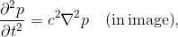
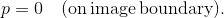
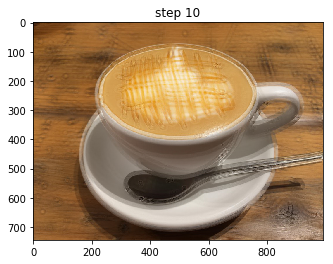
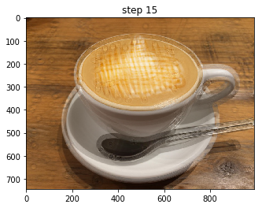

# ImageDynamics
I tried to solve the equation of motion considered the image as a two dimensional scalar field.
By this method, I think that the image can be in various forms.
For example, the processing becomes effective when making teacher data such as artificial intelligence.
## Case 1: Wave equation

Solving the above wave equation, the solution is as follows.
<table border="0" cellspacing="0" cellpadding="5" bordercolor="#333333">
<tr>
<td>
<td>
</tr>
<tr>
<td>
<td>
</tr>
</table>
