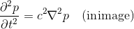
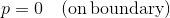

# ImageDynamics
I tried to solve the equation of motion considered the image as a two dimensional scalar field.
By this method, I think that the image can be in various forms.
For example, the processing becomes effective when making teacher data such as artificial intelligence.

## Case 1: Wave equation

Solving the above wave equation, the solution is as follows.
It seems to be vibrating in the earthquake.
<table border="0" cellspacing="0" cellpadding="5" bordercolor="#333333">
<tr>
<td>
<td>
<td>
</tr>
</table>

## Case 2: Diffusion equation

Solving the above diffusion equation, the solution is as follows.
It seems that RGB are averaged so that the temperature distribution becomes thermal equilibrium.
<table border="0" cellspacing="0" cellpadding="5" bordercolor="#333333">
<tr>
<td>
<td>
<td>
</tr>
</table>

## Case 3: Diffusion equation (Negative diffusion coefficient)

Solving the above diffusion equation (Negative diffusion coefficient), the solution is as follows.
An unnatural expression that heat moves from low temperature to high temperature.
In the image, you can see the effect of emphasizing the boundary.
<table border="0" cellspacing="0" cellpadding="5" bordercolor="#333333">
<tr>
<td>
<td>
<td>
</tr>
</table>
